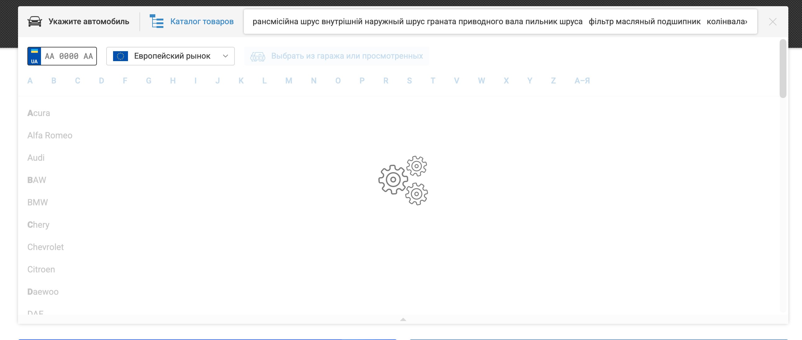

# Bug Report – Bug_002

## Summary
Search hangs and returns HTTP 504 error when very long input is entered.

---

## Application
- Website: https://avto.pro/
- Component: Main Search

---

## Environment
- OS: macOS Tahoe 26.1
- Browser: Safari 26.1

---

## Steps to Reproduce
1. Open the website
2. Enter 1000 characters into the search field
3. Observe the search behavior

---

## Expected Result
Search handles long input correctly and displays a validation message.

---

## Actual Result
Search hangs, server returns HTTP 504 error (observed in DevTools).

---

## Severity
Minor

## Priority
Low

---

## Additional Info
Search request endpoint: `/api/v1/search/query`  
HTTP method: `PUT`

## Evidence

